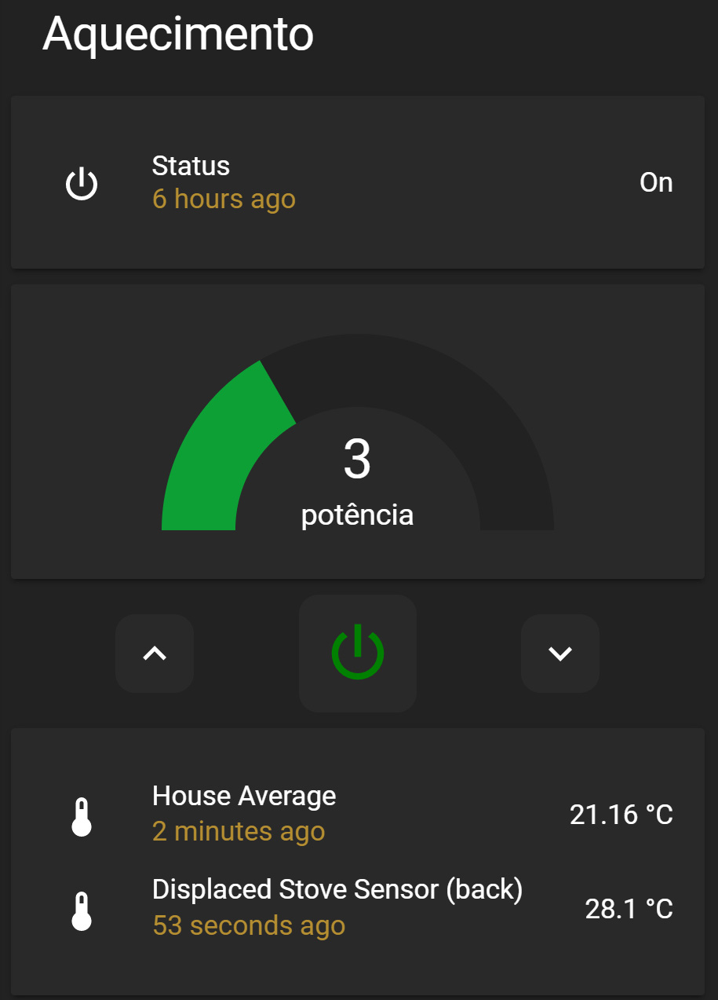

# ecoforest-proxy
proxy server for Ecoforest and Netflame stoves

## run
```
ECOFOREST_HOST=http://10.0.0.0 ECOFOREST_PASSWORD=pwd ECOFOREST_USERNAME=user python ecoforest-proxy.py
```

## Docker compose
```
ecoforest-proxy:  
    build: ./ecoforest_proxy/
    container_name: ecoforest
    restart: always
    environment:
      ECOFOREST_HOST: http://10.0.0.0
      ECOFOREST_PASSWORD: pwd 
      ECOFOREST_USERNAME: user
    ports:
      - 8998:8998
```

## Home Assistant config (configuration.yaml)

## https://github.com/jcwillox/lovelace-paper-buttons-row for the UI Lovelace
## custom buttons (example in pictures at the end)
```
sensor:
  - platform: rest
    name: ecoforest
    resource: 'http://192.168.0.254:8998/ecoforest/fullstats'
    method: 'GET'
    scan_interval: 10
    force_update: true
    json_attributes:
      - temperatura
      - consigna_potencia
      - modo_func
      - modo_operacion
      - state
      - on_off
      - consigna_temperatura
      - estado
      - error_MODO_on_off
  - platform: template
    sensors:
      ecoforest_status:
        entity_id: sensor.ecoforest
        friendly_name: "Status"
        value_template: "{{ state_attr('sensor.ecoforest', 'state') }}"
      ecoforest_temp:
        entity_id: sensor.ecoforest
        friendly_name: "Temperature"
        unit_of_measurement: "°C"
        value_template: "{{ state_attr('sensor.ecoforest', 'consigna_temperatura') }}"
      ecoforest_potencia:
        entity_id: sensor.ecoforest
        friendly_name: "Power"
        value_template: "{{ state_attr('sensor.ecoforest', 'consigna_potencia') }}"
      ecoforest_room_temp:
        entity_id: sensor.ecoforest
        friendly_name: "Room Temperature"
        unit_of_measurement: "°C"
        value_template: "{{ state_attr('sensor.ecoforest', 'temperatura') }}"

switch:        
  - platform: template
    switches:
      ecoforest_switch:
        friendly_name: "Ecoforest On/Off"
        value_template: "{{ (is_state('sensor.ecoforest_status', 'on')) or (is_state('sensor.ecoforest_status', 'starting')) }}"
        turn_on:
          service: rest_command.ecoforest_onoff
          data:
            status: "on"
        turn_off:
          service: rest_command.ecoforest_onoff
          data:
            status: "off"

rest_command:
  ecoforest_powerdown:
    url: http://your_ip_address:8998/ecoforest/set_power?power=down
    method: GET
  ecoforest_powerup:
    url: http://your_ip_address:8998/ecoforest/set_power?power=up
    method: GET
  ecoforest_onoff:
    url: http://your_ip_address:8998/ecoforest/set_status?status={{ status }}
    method: GET
```

## Home Assistant UI Lovelace (ui-lovelace.yaml)
```
      - type: vertical-stack
        title: Heating
        show_header_toggle: false
        cards:
          - type: entities
            state_color: on
            entities:
              - entity: sensor.ecoforest_status 
                secondary_info: last-changed
                icon: 'mdi:power'
          - type: gauge
            entity: sensor.ecoforest_potencia
            name: 'power'
            min: 0
            max: 9
            severity:
              green: 0
              yellow: 4
              red: 7
          - type: "custom:paper-buttons-row"
            buttons:
              - icon: "mdi:chevron-up"
                #name: "up"
                tap_action:
                  action: call-service
                  service: rest_command.ecoforest_powerup
                style: # These are the default styles that can be overridden by state styles.
                  button:
                    border-radius: 10px
                    font-size: 16px
                    background-color: var(--table-row-alternative-background-color)
              - icon: "mdi:power"
                name: false
                entity: switch.ecoforest_switch
                style:
                  button:
                    background-color: var(--table-row-alternative-background-color)
                    border-radius: 10px
                    font-size: 1.2rem
                    padding: 8px
                  icon:
                    width: 40px # make the icon bigger.
                    height: auto
                state_styles:
                  "on":
                    button:
                      background-color: var(--table-row-alternative-background-color)
                    icon:
                      #color: var(--paper-item-icon-active-color)
                      color: green
                  "off": # define a state then provide a style object.
                    button:
                      background-color: var(--table-row-alternative-background-color)
                    icon:
                      color: red
              - icon: "mdi:chevron-down"
                #name: "down"
                tap_action:
                  action: call-service
                  service: rest_command.ecoforest_powerdown
                style: # These are the default styles that can be overridden by state styles.
                  button:
                    border-radius: 10px
                    font-size: 16px
                    background-color: var(--table-row-alternative-background-color)
```


